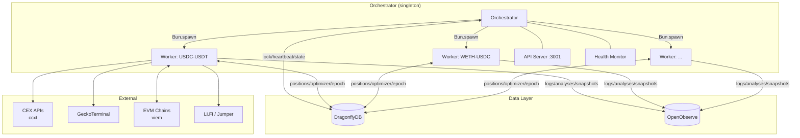

# BTR Agentic ALM

Autonomous concentrated liquidity management across 7 EVM chains and 16 DEXes (41 pools).

## Overview

BTR Agentic ALM is a distributed system that manages Uniswap V3-style liquidity positions with zero human intervention. Each strategy (asset pair) executes a 5-step cycle every 15 minutes:

1. **Fetch** — Multi-source M1 OHLC candles (ccxt) + pool snapshots (GeckoTerminal)
2. **Compute** — 3-force model (volatility, momentum, trend) across M15/H1/H4 timeframes
3. **Optimize** — Nelder-Mead tunes 5 range parameters; water-fill allocates capital across pools
4. **Decide** — PRA (pool reallocation), RS (range shift), or HOLD
5. **Execute** — Burn, cross-chain swap/bridge (Li.Fi/Jumper), mint across V3/V4/LB DEXes

## Architecture



**Orchestrator** — Singleton process protected by DragonflyDB lock. Spawns one worker per pair, monitors heartbeats, respawns on failure with exponential backoff.

**Workers** — Independent processes per asset pair. Each runs its own scheduler loop, maintains in-memory candle buffer, and executes on-chain transactions.

**DragonflyDB** — Hot state: positions, optimizer warm-start, epoch counters, regime state, config CRUD.

**OpenObserve** — Cold storage: logs, candles, pool analyses, allocations, epoch snapshots, transaction logs.

## Supported Networks

| Chain | ID | DEXes |
|-------|----|----|
| Ethereum | 1 | Uniswap V3/V4 |
| BSC | 56 | PancakeSwap V3/V4 |
| Polygon | 137 | QuickSwap V3 |
| Base | 8453 | Aerodrome V3 |
| Arbitrum | 42161 | Ramses, Pharaoh |
| Avalanche | 43114 | Trader Joe LB, Pangolin |
| HyperEVM | 999 | Ramses PM |

**DEX Families:** V3, Algebra, Aerodrome, V4, LB (Liquidity Book)

## Quick Start

```bash
# Install dependencies
bun install

# Run single-instance (dev/CLI mode)
bun run start

# Run orchestrated (production mode)
bun run orchestrate

# Run tests
bun test
```

### Docker

```bash
# Start infrastructure + backend + dashboard
docker compose up -d

# Services:
# - DragonflyDB: localhost:6379
# - OpenObserve: localhost:5080
# - API: localhost:3001
# - Dashboard: localhost:80
```

### Dashboard

```bash
cd dashboard && bun install && bun run dev
```

Open `http://localhost:5173`. Press `Cmd+K` for documentation search.

## Documentation

| Section | Description |
|---------|-------------|
| [System Overview](docs/overview.md) | What it does, key differentiators |
| [Architecture](docs/architecture.md) | Process topology, data flow, module map |
| [Strategy: 3-Force Model](docs/strategy/forces.md) | Volatility, momentum, trend signals |
| [Strategy: Range Optimizer](docs/strategy/optimizer.md) | Nelder-Mead online tuning |
| [Strategy: Decision Engine](docs/strategy/decision.md) | PRA / RS / HOLD logic |
| [Execution: Position Adapters](docs/execution/positions.md) | V3, V4, LB mint/burn |
| [Infrastructure: Orchestrator](docs/infrastructure/orchestrator.md) | Worker spawning, health monitoring |
| [Infrastructure: API](docs/infrastructure/api.md) | REST endpoints, authentication |
| [Full Index](docs/index.md) | All documentation pages |

## Tech Stack

| Layer | Technology |
|-------|------------|
| Runtime | Bun (TypeScript, no transpilation) |
| EVM | viem (multicall, contract reads/writes) |
| CEX Data | ccxt (Binance, Bybit, OKX, MEXC, Gate, Bitget) |
| Pool Data | GeckoTerminal REST API |
| Hot State | DragonflyDB (Redis-compatible) |
| Cold Storage | OpenObserve (SQL queries, buffered ingestion) |
| Swap/Bridge | Li.Fi / Jumper API |
| Frontend | Svelte 5 + Tailwind 4 |

## Contributing

See [CONTRIBUTING.md](CONTRIBUTING.md) for development guidelines and commit conventions.
