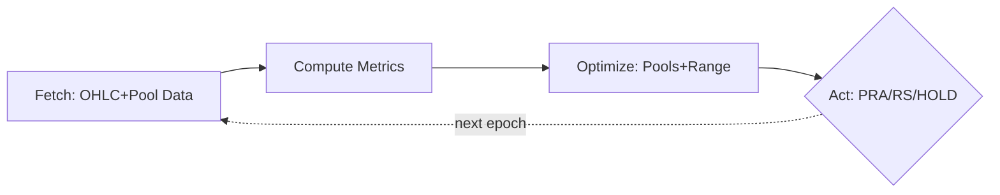
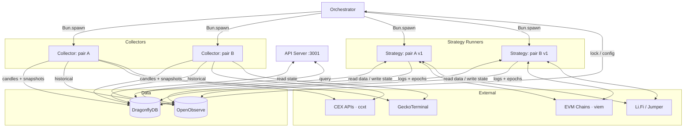

# BTR Prime

Autonomous concentrated liquidity management across 7 EVM chains, 20+ DEXes, and hundreds of pools.
Full TypeScript, trimmed down and without vault infra.
The EOAs can easily be replaced by [Smart Accounts](docs/migration-smart-accounts.md) to turn into a trustless protocol.

## Overview

BTR Prime manages Uniswap V3-style liquidity positions with zero human intervention. Each strategy runs a 5-step cycle every 15 minutes:


```mermaid
flowchart LR
    F[Fetch: OHLC+Pool Data] --> C[Compute Metrics] --> O[Optimize: Pools+Range] --> D[Act: PRA/RS/HOLD]
    D -.->|next epoch| F

    F@{ shape: process }
    C@{ shape: process }
    O@{ shape: process }
    D@{ shape: diamond }
```

| Step | What happens |
|------|-------------|
| **Fetch** | Multi-source M1 OHLC candles (ccxt) + pool snapshots (GeckoTerminal) |
| **Compute** | 3-force model (volatility, momentum, trend) across M15/H1/H4 timeframes |
| **Optimize** | Nelder-Mead tunes 5 range parameters; water-fill allocates capital across pools |
| **Decide** | PRA (pool reallocation), RS (range shift), or HOLD |
| **Execute** | Burn, rebalance via Li.Fi/Jumper, mint across V3/V4/LB DEXes |

## Key Concepts

| Term | Definition |
|------|-----------|
| **Pair** | A token pair (e.g., USDC-USDT). One pair can be served by many strategies. |
| **Strategy** | A configured trading strategy on a specific pair. Multiple strategies can share the same pair. |
| **Worker** | Generic term for any independent process managed by the orchestrator. Two types: collector and strategy runner. |
| **Collector** | A worker that fetches market (OHLC) and pool (GeckoTerminal) data for a pair. Singleton per pair — one collector per pair, shared by all strategies on that pair. Persists independently of strategies. |
| **Strategy runner** | A worker that executes a trading strategy. Reads collected data from the collector for its pair. |

## Architecture


```mermaid
graph TD
    API[API Server :3001] <-->|read state| DF
    API <-->|query| O2
    O[Orchestrator] -->|Bun.spawn| C1 & C2 & S1 & S2

    subgraph Collectors
        C1[Collector: pair A]
        C2[Collector: pair B]
    end

    subgraph Strategy Runners
        S1[Strategy: pair A v1]
        S2[Strategy: pair B v1]
    end

    subgraph Data
        DF[(DragonflyDB)]
        O2[(OpenObserve)]
    end

    subgraph External
        CEX[CEX APIs · ccxt]
        GECKO[GeckoTerminal]
        CHAINS[EVM Chains · viem]
        BRIDGE[Li.Fi / Jumper]
    end

    O <-->|lock / config| DF
    C1 & C2 -->|candles + snapshots| DF
    C1 & C2 -->|historical| O2
    C1 & C2 --> CEX & GECKO
    S1 & S2 <-->|read data / write state| DF
    S1 & S2 -->|logs + epochs| O2
    S1 & S2 <--> CHAINS & BRIDGE
```

**API Server** — Stateless HTTP server reading from DragonflyDB and OpenObserve. Runs as an independent process, isolated from orchestrator failures.

**Orchestrator** — Singleton protected by DragonflyDB lock. Manages two worker types: collectors (one per pair) and strategy runners (one per strategy). Ensures collectors are running before starting strategies. Monitors heartbeats, respawns with exponential backoff.

**Collectors** — Independent worker processes, one per token pair (singleton). Each fetches OHLC candles (via ccxt) and pool snapshots (via GeckoTerminal) on the pair's interval. Writes data to shared DragonflyDB keys and ingests to OpenObserve. Persists even when strategies stop — configured via a dedicated collector pair list.

**Strategy Runners** — Independent worker processes, one per strategy. Each reads collected data from DragonflyDB (written by the collector for its pair), computes forces, optimizes, decides, and executes on-chain. Falls back to direct data fetching in standalone mode.

**DragonflyDB** — Hot state: positions, optimizer warm-start, epoch counters, config CRUD, shared collected data (candles + snapshots).

**OpenObserve** — Cold storage: logs, candles, pool analyses, allocations, epoch snapshots.

## Supported Networks

| Chain | ID | DEXes |
|-------|---:|-------|
| Ethereum | 1 | Uniswap V3/V4, PancakeSwap V3 |
| BNB Chain | 56 | Uniswap V3/V4, PancakeSwap V3/V4 |
| Polygon | 137 | Uniswap V3/V4, QuickSwap V3 |
| Base | 8453 | Uniswap V3/V4, Aerodrome V3, PancakeSwap V3 |
| Arbitrum | 42161 | Uniswap V3/V4, PancakeSwap V3, Camelot V3, Ramses V3 |
| Avalanche | 43114 | Uniswap V3, Pangolin V3, Blackhole V3, Pharaoh V3, Joe V2/V2.1/V2.2 |
| HyperEVM | 999 | Ramses V3, Project X V3, Hybra V4 |

**DEX families:** V3 (Uniswap-style), Algebra (V3 fork), V4, LB (Liquidity Book)

## Quick Start

```bash
bun install
cp .env.example .env   # configure private keys and pairs
```

### Development

Dev mode runs the DB stack (DragonflyDB + OpenObserve) in Docker while the backend and dashboard run locally with hot reload.

```bash
# Terminal 1 — infrastructure + backend (watch mode)
bun run dev

# Terminal 2 — dashboard (Vite dev server with HMR)
bun run dev:front
# http://localhost:5173 — Cmd+K for doc search
```

| Script | What it does |
|--------|-------------|
| `bun run dev` | Starts Docker infra + orchestrator + API with `--watch` |
| `bun run dev:infra` | Starts only DragonflyDB + OpenObserve containers |
| `bun run dev:api` | API server only with `--watch` |
| `bun run dev:back` | Orchestrator + API with `--watch` |
| `bun run dev:front` | Dashboard Vite dev server (port 5173) |
| `bun run start` | Single-instance CLI mode (no Docker) |
| `bun run orchestrate` | Orchestrator only (no Docker, no API) |

### Production

Prod mode containerizes everything: DB stack, API, orchestrator, and dashboard as separate containers.

```bash
bun run prod
# DragonflyDB :6379 · OpenObserve :5080 · API :3001 · Dashboard :80
```

| Script | What it does |
|--------|-------------|
| `bun run prod` | Builds and starts the full stack (6 containers) |
| `bun run prod:down` | Stops and removes all containers |

### Tests

```bash
bun test
```

## Documentation

| Section | Topics |
|---------|--------|
| [Architecture](docs/architecture.md) | Process topology, data flow, module map |
| [Strategy](docs/strategy/forces.md) | 3-force model, [range optimizer](docs/strategy/optimizer.md), [allocation](docs/strategy/allocation.md), [decisions](docs/strategy/decision.md) |
| [Execution](docs/execution/positions.md) | Position adapters, [rebalancing](docs/execution/swap.md), [TX lifecycle](docs/execution/transactions.md) |
| [Infrastructure](docs/infrastructure/orchestrator.md) | Orchestration, [API](docs/infrastructure/api.md), [observability](docs/infrastructure/observability.md), [deployment](docs/infrastructure/deployment.md) |
| [Configuration](docs/config/chains.md) | [Chains](docs/config/chains.md), [DEXes](docs/config/dexs.md), [pools](docs/config/pools.md), [tokens](docs/config/tokens.md) |
| [Dashboard](docs/dashboard/overview.md) | Svelte 5 SPA, [components](docs/dashboard/components.md) |
| [Glossary](docs/glossary.md) | Domain terms and abbreviations |
| **[Full Index](docs/index.md)** | **All documentation pages** |

## Tech Stack

| Layer | Technology |
|-------|------------|
| Runtime | Bun |
| EVM | viem |
| CEX Data | ccxt |
| Pool Data | GeckoTerminal |
| Hot State | DragonflyDB |
| Cold Storage | OpenObserve |
| Swap/Bridge | Li.Fi / Jumper |
| Frontend | Svelte 5 + Tailwind 4 |

## Contributing

See [CONTRIBUTING.md](CONTRIBUTING.md) for development guidelines and commit conventions.
