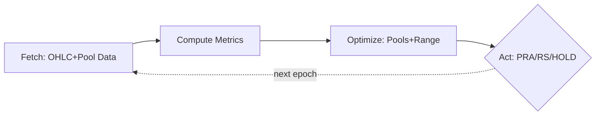
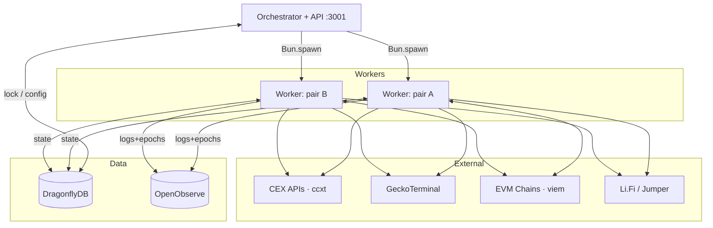

# BTR Light ALM

Autonomous concentrated liquidity management across 7 EVM chains, 20+ DEXes, and hundreds of pools.
Light port of BTR Supply ALM v1, full TypeScript, trimmed down and without vault infra.
The EOAs can easily be replaced by [Smart Accounts](docs/migration-smart-accounts.md) to turn into a trustless protocol.

## Overview

BTR Light ALM manages Uniswap V3-style liquidity positions with zero human intervention. Each strategy (asset pair) runs a 5-step cycle every 15 minutes:



| Step | What happens |
|------|-------------|
| **Fetch** | Multi-source M1 OHLC candles (ccxt) + pool snapshots (GeckoTerminal) |
| **Compute** | 3-force model (volatility, momentum, trend) across M15/H1/H4 timeframes |
| **Optimize** | Nelder-Mead tunes 5 range parameters; water-fill allocates capital across pools |
| **Decide** | PRA (pool reallocation), RS (range shift), or HOLD |
| **Execute** | Burn, rebalance via Li.Fi/Jumper, mint across V3/V4/LB DEXes |

## Architecture



**Orchestrator** — Singleton protected by DragonflyDB lock. Spawns one worker per pair, monitors heartbeats, serves the REST API, respawns with exponential backoff.

**Workers** — Independent processes, one per asset pair. Each runs its own scheduler loop, candle buffer, and on-chain execution.

**DragonflyDB** — Hot state: positions, optimizer warm-start, epoch counters, config CRUD.

**OpenObserve** — Cold storage: logs, candles, pool analyses, allocations, epoch snapshots.

## Supported Networks

| Chain | ID | DEXes |
|-------|---:|-------|
| Ethereum | 1 | Uniswap V3/V4, PancakeSwap V3 |
| BNB Chain | 56 | Uniswap V3/V4, PancakeSwap V3/V4 |
| Polygon | 137 | Uniswap V3/V4, QuickSwap V3 |
| Base | 8453 | Uniswap V3/V4, Aerodrome V3, PancakeSwap V3 |
| Arbitrum | 42161 | Uniswap V3/V4, PancakeSwap V3, Camelot V3, Ramses V3 |
| Avalanche | 43114 | Uniswap V3, Pangolin V3, Blackhole V3, Pharaoh V3, Joe V2/V2.1/V2.2 |
| HyperEVM | 999 | Ramses V3, Project X V3, Hybra V4 |

**DEX families:** V3 (Uniswap-style), Algebra (V3 fork), V4, LB (Liquidity Book)

## Quick Start

```bash
bun install
cp .env.example .env   # configure private keys and pairs
```

### Development

Dev mode runs the DB stack (DragonflyDB + OpenObserve) in Docker while the backend and dashboard run locally with hot reload.

```bash
# Terminal 1 — infrastructure + backend (watch mode)
bun run dev

# Terminal 2 — dashboard (Vite dev server with HMR)
bun run dev:front
# http://localhost:5173 — Cmd+K for doc search
```

| Script | What it does |
|--------|-------------|
| `bun run dev` | Starts Docker DB stack + backend with `--watch` |
| `bun run dev:infra` | Starts only DragonflyDB + OpenObserve containers |
| `bun run dev:back` | Runs backend only (no Docker, no checks) |
| `bun run dev:front` | Runs dashboard Vite dev server (port 5173) |
| `bun run start` | Single-instance CLI mode (no Docker) |
| `bun run orchestrate` | Multi-worker orchestrated mode (no Docker) |

### Production

Prod mode containerizes everything: DB stack, backend, and dashboard.

```bash
bun run prod
# DragonflyDB :6379 · OpenObserve :5080 · API :3001 · Dashboard :80
```

| Script | What it does |
|--------|-------------|
| `bun run prod` | Builds and starts all 4 containers |
| `bun run prod:down` | Stops and removes all containers |

### Tests

```bash
bun test
```

## Documentation

| Section | Topics |
|---------|--------|
| [Architecture](docs/architecture.md) | Process topology, data flow, module map |
| [Strategy](docs/strategy/forces.md) | 3-force model, [range optimizer](docs/strategy/optimizer.md), [allocation](docs/strategy/allocation.md), [decisions](docs/strategy/decision.md) |
| [Execution](docs/execution/positions.md) | Position adapters, [rebalancing](docs/execution/swap.md), [TX lifecycle](docs/execution/transactions.md) |
| [Infrastructure](docs/infrastructure/orchestrator.md) | Orchestration, [API](docs/infrastructure/api.md), [observability](docs/infrastructure/observability.md), [deployment](docs/infrastructure/deployment.md) |
| [Configuration](docs/config/chains.md) | [Chains](docs/config/chains.md), [DEXes](docs/config/dexs.md), [pools](docs/config/pools.md), [tokens](docs/config/tokens.md) |
| [Dashboard](docs/dashboard/overview.md) | Svelte 5 SPA, [components](docs/dashboard/components.md) |
| [Glossary](docs/glossary.md) | Domain terms and abbreviations |
| **[Full Index](docs/index.md)** | **All documentation pages** |

## Tech Stack

| Layer | Technology |
|-------|------------|
| Runtime | Bun |
| EVM | viem |
| CEX Data | ccxt |
| Pool Data | GeckoTerminal |
| Hot State | DragonflyDB |
| Cold Storage | OpenObserve |
| Swap/Bridge | Li.Fi / Jumper |
| Frontend | Svelte 5 + Tailwind 4 |

## Contributing

See [CONTRIBUTING.md](CONTRIBUTING.md) for development guidelines and commit conventions.
