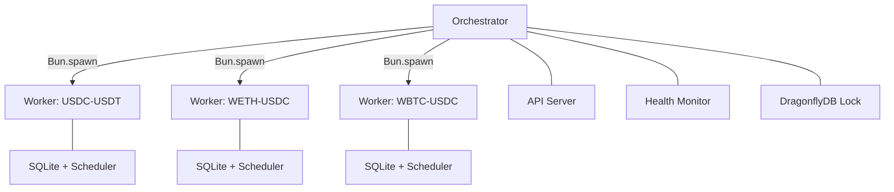
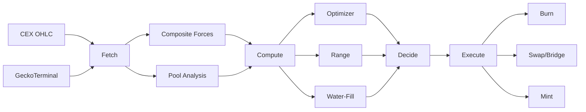

# System Architecture

## Process Topology

The **orchestrator** (`src/orchestrator.ts`) is a singleton process protected by a DragonflyDB lock (TTL 60s, refreshed every 10s). It spawns one worker per configured pair, monitors heartbeats, and respawns crashed workers with exponential backoff (capped at 5 minutes, max 20 retries).

Each **worker** (`src/worker.ts`) is an independent Bun process with its own SQLite database, scheduler loop, and DragonflyDB lock. Workers publish `WorkerState` JSON to Redis and listen on a pub/sub control channel for SHUTDOWN/RESTART commands.

The **API server** runs inside the orchestrator process in dual mode:
- **Orchestrated mode**: reads worker state from DragonflyDB, opens read-only SQLite handles
- **Legacy mode**: in-memory registry for single-process development

## Data Flow

## Module Map

| Directory | Purpose |
|-----------|---------|
| `src/config/` | Static configuration: chains, DEXes, pools, pairs, tokens, params |
| `src/data/` | Data ingestion: OHLC (ccxt), GeckoTerminal, SQLite store |
| `src/strategy/` | Signal computation: forces, range, optimizer, allocation, decision |
| `src/execution/` | On-chain operations: V3/Algebra/Aerodrome, V4, LB position adapters |
| `src/infra/` | Infrastructure: Redis client, OpenObserve logger, structured logger |
| `src/adapters/` | Pool state queries (on-chain reads via viem) |

Key top-level files:

| File | Role |
|------|------|
| `src/orchestrator.ts` | Process supervisor, health monitor, API host |
| `src/worker.ts` | Single-pair process: lock, DB, scheduler, heartbeat |
| `src/scheduler.ts` | 5-step cycle loop (fetch/compute/decide/execute/log) |
| `src/executor.ts` | PRA and RS execution orchestration (burn/swap/mint) |
| `src/state.ts` | In-memory `PairRuntime` registry, `WorkerState` serialization |
| `src/api.ts` | HTTP API (Bun.serve) |

## Tech Stack

| Layer | Technology |
|-------|-----------|
| Runtime | Bun (TypeScript, no transpilation) |
| EVM RPC | viem (multicall, contract reads/writes) |
| CEX data | ccxt (Binance, Bybit, OKX, MEXC, Gate, Bitget) |
| Pool data | GeckoTerminal REST API |
| Local DB | bun:sqlite (WAL mode, one DB per pair) |
| Coordination | DragonflyDB (Redis-compatible, Bun built-in `RedisClient`) |
| Telemetry | OpenObserve (HTTP buffered ingestion) |
| Swap/Bridge | Li.Fi / Jumper API |
| Token approvals | Permit2 (canonical address) |

## See Also

- [System Overview](overview.md) -- what the system does
- [Decision Engine](strategy/decision.md) -- the decide step in detail
- [3-Force Model](strategy/forces.md) -- the compute step's signal engine
- [Range Optimizer](strategy/optimizer.md) -- online parameter tuning
- [Glossary](glossary.md) -- domain terms
