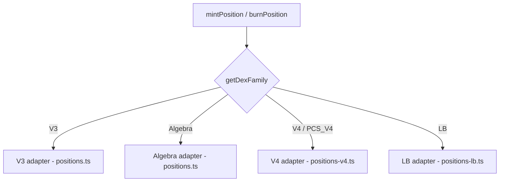

# DEX Position Adapters

Unified interface for minting and burning LP positions across 4 DEX families and 16 DEX IDs.

## Architecture

The position layer uses a **dispatcher pattern**: `mintPosition` and `burnPosition` inspect the pool's DEX family and delegate to a family-specific adapter. Callers never interact with adapters directly.

**Source**: `src/execution/positions.ts`, `src/execution/positions-v4.ts`, `src/execution/positions-lb.ts`

## DEX Families

| Family | DEXs | Token Standard | ID Format |
|--------|------|---------------|-----------|
| **V3** | Uniswap V3, PancakeSwap V3, Pangolin, Pharaoh, Ramses, Camelot, QuickSwap, Project-X, Aerodrome | ERC-721 | uint256 tokenId |
| **Algebra** | Blackhole (Algebra Integral) | ERC-721 | uint256 tokenId |
| **V4** | Uniswap V4, PCS V4 | ERC-721 | uint256 tokenId (pool is bytes32) |
| **LB** | Trader Joe V2/V2.1/V2.2 | ERC-1155 | `lb:{lowerBin}:{upperBin}` |

## V3 Adapter (`positions.ts`)

Standard NonfungiblePositionManager flow. Tick ranges must be aligned to the pool's `tickSpacing`. The adapter encodes a `mint` call with `(token0, token1, fee, tickLower, tickUpper, amount0Desired, amount1Desired, amount0Min, amount1Min, recipient, deadline)`.

Burns call `decreaseLiquidity` followed by `collect` to withdraw tokens. The tokenId (ERC-721) is stored in the positions table and used for subsequent burns.

## Algebra Adapter (`positions.ts`)

Blackhole V3 is **Algebra Integral**, not standard Uniswap V3 despite the naming. The critical difference: price discovery uses `globalState()` instead of `slot0()`. The mint/burn encoding is otherwise compatible with the V3 NonfungiblePositionManager, but the pool contract ABI diverges for reads.

## V4 Adapter (`positions-v4.ts`)

Uniswap V4 and PancakeSwap V4 use a singleton PositionManager with action-encoded multicalls. Pool IDs are **bytes32** (66 hex characters), and the adapter must reconstruct the full `PoolKey` at mint time.

Key difference from V3: the V4 PositionManager does **not** compute liquidity from token amounts internally. The adapter must calculate liquidity using `computeLiquidity(sqrtPriceX96, tickLower, tickUpper, amount0, amount1)` with 3 conditional branches:

1. **Price below range** ($P \le P_L$): all token0 -- $L = \frac{a_0 \cdot \sqrt{P_L} \cdot \sqrt{P_H}}{(\sqrt{P_H} - \sqrt{P_L}) \cdot Q_{96}}$
2. **Price above range** ($P \ge P_H$): all token1 -- $L = \frac{a_1 \cdot Q_{96}}{\sqrt{P_H} - \sqrt{P_L}}$
3. **Price in range**: constrained by both tokens -- $L = \min(L_0, L_1)$ where:
   - $L_0 = \frac{a_0 \cdot \sqrt{P} \cdot \sqrt{P_H}}{(\sqrt{P_H} - \sqrt{P}) \cdot Q_{96}}$
   - $L_1 = \frac{a_1 \cdot Q_{96}}{\sqrt{P} - \sqrt{P_L}}$

Action encoding sequence for mint:
1. `MINT_POSITION` (0x02) -- create the position with computed liquidity
2. `SETTLE_PAIR` (0x0d) -- transfer tokens into the pool

Burns encode `BURN_POSITION` (0x03) + `TAKE_PAIR` (0x11). The `burnPosition` function requires a `pair` parameter for V4 burns to resolve sorted token addresses.

Permit2 integration: V4 pools require token approvals through the Permit2 contract rather than direct ERC-20 approvals to the PositionManager.

### PoolKey Reconstruction

V4 pool IDs are keccak256 hashes of the `PoolKey` struct. At mint time, the adapter:
1. Reads `slot0` and `tickSpacing` from the V4 StateView (or PCS CLPoolManager)
2. Sorts token addresses
3. Constructs the PoolKey with fee, tickSpacing, and hooks (default: zero address)
4. Verifies the keccak256 hash matches the pool ID (warns on mismatch for hooked pools)

PCS V4 uses a different PoolKey format with `parameters` (packed bytes32 encoding tickSpacing) and `poolManager` fields.

## LB Adapter (`positions-lb.ts`)

Trader Joe Liquidity Book uses discrete price bins instead of continuous tick ranges. Positions are **ERC-1155** tokens -- each bin is a separate token ID.

The position ID format is `lb:{lowerBin}:{upperBin}`, stored in the positions table. On mint, the adapter distributes liquidity across all bins in the range, then calls the LB Router's `addLiquidity` with the bin array and per-bin amounts.

Burns call `removeLiquidity` with the full array of bin IDs. The router handles collecting tokens from each bin in a single transaction.

## Common Flow

All adapters follow the same lifecycle:

1. **Approve** -- ERC-20 approve (or Permit2 for V4) to the Position Manager / Router
2. **Encode** -- build the calldata for the mint or burn operation
3. **Simulate** -- `eth_call` pre-flight to catch reverts before gas spend
4. **Send** -- submit the transaction with 120% gas buffer
5. **Extract** -- parse the receipt for tokenId (V3/Algebra/V4) or confirm bin updates (LB)

Slippage protection: `amount0Min` / `amount1Min` are set to `amount * (10000 - 50) / 10000`, defaulting to 50bps.

## Error Handling

- `SimulationError` -- thrown when `eth_call` reverts, includes chain ID, target contract, and revert reason
- Approval failures are caught before simulation
- Receipt timeout (120s) triggers a viem-level error

## See Also

- [Range Computation](../strategy/range.md) -- tick ranges derive from the strategy range output
- [Decision Engine](../strategy/decision.md) -- PRA/RS decisions that trigger mint/burn
- [DEX Registry](../config/dexs.md) -- DEX IDs, families, ABI fragments, PM addresses
- [Pool Registry](../config/pools.md) -- pool addresses and bytes32 IDs
- [TX Lifecycle](./transactions.md) -- simulation, gas, receipts
- [Token Registry](../config/tokens.md) -- decimals and chain-specific addresses
