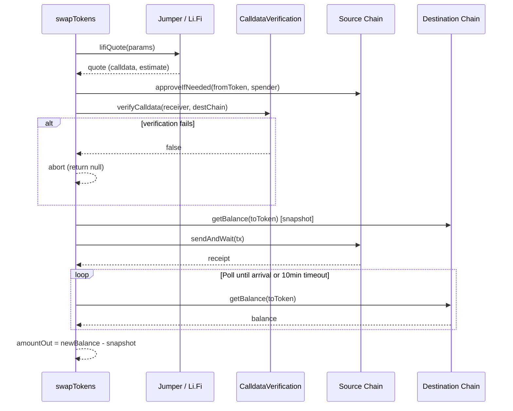

# Token Rebalancing & Bridging

**Source**: `src/execution/swap.ts`

Handles token swaps for rebalancing and cross-chain bridging via two aggregator backends.

## Rebalancing Trigger

When the token ratio deviates more than **5%** from the target allocation (typically 50/50 for stablecoin pairs), the executor triggers a rebalance swap. The swap amount is calculated to restore the target split.

**Bridge threshold**: cross-chain transfers are only initiated if more than **1%** of total position value needs to move to a different chain (`BRIDGE_THRESHOLD`). Below this threshold, the system rebalances using same-chain swaps only.

## Aggregator Backends

### Jumper (Primary)

- **Fee**: 0% integrator fee
- **Flow**: two-step process
  1. `POST /routes` -- fetch available routes with parameters (fromChain, toChain, fromToken, toToken, fromAmount)
  2. `POST /stepTransaction` -- get the calldata for the selected route step
- Routes are scored by output amount after gas costs
- Rate limit: 5,000ms between requests (`JUMPER_RATE_LIMIT_MS`)
- Supports both same-chain swaps and cross-chain bridges

### Li.Fi (Fallback)

- **Fee**: 0.25% integrator fee (requires `LIFI_API_KEY`)
- **Flow**: single-step
  1. `GET /quote` -- returns route + calldata in one call
- Rate limit: 2,000ms between requests (`LIFI_RATE_LIMIT_MS`)
- Used when Jumper returns no viable routes or errors

## Cross-Chain Swap Lifecycle

### Calldata Verification

The Li.Fi Diamond contract exposes a `CalldataVerificationFacet` that allows on-chain validation of swap parameters before execution via `staticcall`:

- **Same-chain swaps**: `extractGenericSwapParameters` verifies the receiver address
- **Cross-chain bridges**: `extractMainParameters` verifies the receiver, destination chain, and ensures no destination call is embedded

This is a pre-flight safety check, not a gas-spending transaction.

### Cross-Chain Polling

For bridge transactions, after the source-chain TX confirms, the system polls the destination chain for token arrival:

- **Poll interval**: `4 * blockTimeMs` for the destination chain
- **Timeout**: 10 minutes (`BRIDGE_TIMEOUT_MS`)
- **Detection**: ERC-20 `balanceOf` check -- arrival detected when balance exceeds the pre-send snapshot

If the bridge does not arrive within the timeout, an error is thrown.

## Approval Strategy

Token approvals are granted to the aggregator's approval address (from the quote, defaulting to the Li.Fi Diamond `0x1231DEB6f5749EF6cE6943a275A1D3E7486F4EaE`). Approvals are checked before each swap and only sent if the current allowance is insufficient.

## Error Handling

| Error | Handling |
|-------|----------|
| No routes available | Fall back to Li.Fi; if both fail, return null |
| TX revert | SimulationError caught in pre-flight; reverted receipt returns null |
| Calldata verification failed | Abort swap, log warning, return null |
| Bridge timeout | Throw error after 10min |
| Rate limit | Built-in `RateLimiter` enforces minimum delay between requests |

## Configuration

| Parameter | Value | Source |
|-----------|-------|--------|
| Max price impact | 0.4% | `SWAP_MAX_PRICE_IMPACT` |
| Default slippage | 0.5% | `SWAP_DEFAULT_SLIPPAGE` |
| Bridge threshold | 1% of position value | `BRIDGE_THRESHOLD` |
| Bridge poll timeout | 10 min | `BRIDGE_TIMEOUT_MS` |
| Jumper rate limit | 5,000ms | `JUMPER_RATE_LIMIT_MS` |
| Li.Fi rate limit | 2,000ms | `LIFI_RATE_LIMIT_MS` |
| HTTP timeout | 30s | `FETCH_TIMEOUT_MS` |

## See Also

- [Decision Engine](../strategy/decision.md) -- PRA/RS decisions that trigger swaps
- [Water-Fill Allocation](../strategy/allocation.md) -- allocation targets driving cross-chain moves
- [TX Lifecycle](./transactions.md) -- simulation, gas, receipt handling
- [Token Registry](../config/tokens.md) -- addresses and decimal handling
- [DEX Position Adapters](./positions.md) -- mint/burn after rebalance
- [Chain Configuration](../config/chains.md) -- RPC endpoints for cross-chain
