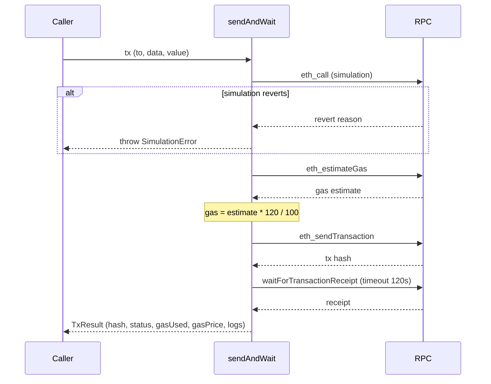

# TX Lifecycle

**Source**: `src/execution/tx.ts`

Low-level transaction submission, simulation, and receipt management for all on-chain operations.

## Overview



## Pre-Flight Simulation

Every transaction is simulated via `eth_call` before submission. This catches reverts, insufficient balances, and contract errors without spending gas. The simulation uses the same calldata and value that would be sent in the real transaction.

On failure, a `SimulationError` is thrown containing:
- `chainId` -- the chain where the simulation failed
- `to` -- the contract address being called
- `cause` -- decoded revert reason or raw error message

Simulation runs against the `latest` block to reflect current on-chain state.

## Gas Estimation

Gas is estimated via `eth_estimateGas` and a **120% buffer** is applied to the result. This accounts for state changes between estimation and mining, particularly on fast chains where MEV and state contention are common.

```
gasLimit = estimatedGas * 120 / 100
```

Gas price strategy is delegated to viem's chain-aware transport -- EIP-1559 chains use `maxFeePerGas` + `maxPriorityFeePerGas`, legacy chains use `gasPrice`.

## Token Approvals

Before any position or swap operation, the required token approvals are checked and issued:

- **V3/Algebra/Aerodrome**: approve to the NonfungiblePositionManager
- **V4**: approve to the Permit2 contract, then Permit2 allowance to the PositionManager
- **LB**: approve to the LB Router
- **Swaps**: approve to the Li.Fi Diamond or Jumper contract

Approval amount is **2x the required amount** for the operation. The approval TX itself goes through the same simulate-then-send pipeline. Token pairs are approved sequentially to avoid nonce collisions.

### Permit2 (V4 Pools)

Uniswap V4 and PCS V4 require the Permit2 flow:
1. ERC-20 `approve` to the Permit2 contract (`0x000000000022D473030F116dDEE9F6B43aC78BA3`)
2. Permit2 `approve(token, spender, amount, expiration)` to the V4 PositionManager with 30-day expiry
3. PositionManager pulls tokens through Permit2 during mint

The Permit2 allowance check reads `(currentAmount, expiration, nonce)` and only re-approves if the amount is insufficient or the expiration has passed.

## Transaction Submission

After simulation passes and gas is estimated:

1. Transaction is signed and submitted via viem's `sendTransaction`
2. TX hash is returned immediately

## Receipt Polling

After submission, the system waits for the transaction receipt via viem's `waitForTransactionReceipt`:

- **Timeout**: 120 seconds (`TX_RECEIPT_TIMEOUT_MS`)
- **Success**: receipt with `status === "success"`
- **Failure**: receipt with `status === "reverted"` -- logged as error, returned to caller

The receipt is parsed for relevant logs (e.g., `Transfer`, `IncreaseLiquidity`) to extract results like tokenId or collected amounts.

## Slippage Protection

Default slippage tolerance is **50bps** (0.5%) via `DEFAULT_SLIPPAGE_BPS`. Slippage is applied to:

- `amount0Min` / `amount1Min` in mint operations
- `amountMin` in burn operations (liquidity decrease)
- `minOutputAmount` in swap operations

```
minAmount = amount * (10000 - 50) / 10000
```

## Error Handling

Only one custom error type exists:

| Error | Description | Retryable |
|-------|-------------|-----------|
| `SimulationError` | `eth_call` simulation reverted before gas spend | No (state issue) |

Other failure modes are handled by the return value or viem's built-in errors:

- **Receipt status "reverted"**: the `TxResult.status` field is `"reverted"` -- callers check this
- **Receipt timeout**: viem throws after 120s if no receipt arrives -- the TX may still mine later
- **RPC errors**: propagated as standard errors from the viem transport

## TX Logging

Every transaction (successful or failed) is ingested to the `tx_log` OpenObserve stream with: ts, decision_type, op_type, pool, chain, tx_hash, status, gas_used, gas_price, input/output token details, and allocation tracking metrics.

## See Also

- [DEX Position Adapters](./positions.md) -- mint/burn calldata encoding
- [Token Rebalancing](./swap.md) -- swap-specific TX flow
- [Chain Configuration](../config/chains.md) -- RPC URLs and block times
- [Observability](../infrastructure/observability.md) -- tx_log O2 stream
- [Glossary](../glossary.md) -- slippage, gas buffer, BPS definitions
