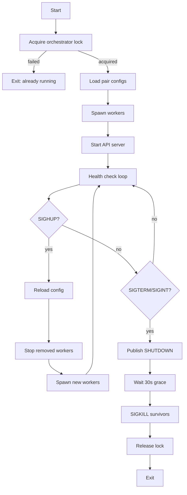

# Process Orchestration

Process-per-strategy architecture using DragonflyDB for coordination and Bun.spawn for worker lifecycle management.

## Architecture

The system follows a **process-per-strategy** model. One orchestrator process manages multiple worker processes, each responsible for a single pair's strategy execution. DragonflyDB (Redis-compatible) provides distributed locking and state publication.

```
Orchestrator (singleton)
    |-- Health Monitor (10s interval)
    |-- API Server (port 3001)
    |-- Worker: USDC-USDT
    |-- Worker: WETH-USDC
    +-- Worker: ...
```

## Lifecycle



## Orchestrator

### Singleton Lock

The orchestrator acquires an exclusive lock on DragonflyDB to prevent multiple orchestrator instances:

- **Key**: `btr:orchestrator:lock`
- **TTL**: 60 seconds (`ORCHESTRATOR_LOCK_TTL * 2` for safety margin)
- **Renewal**: every 10 seconds via Lua CAS script (`HEALTH_CHECK_INTERVAL`)
- **Acquisition**: `SET key value PX ttl NX` (atomic)

If the lock cannot be acquired (another orchestrator is running), the process exits immediately.

### Worker Spawning

Workers are spawned via `Bun.spawn` with the worker entry point and pair ID as arguments. Each worker runs as an independent OS process with its own memory space and SQLite connection.

```typescript
Bun.spawn(["bun", workerPath, pairId], {
  env: { ...process.env, WORKER_PAIR_ID: pairId },
  stdout: "inherit",
  stderr: "inherit",
})
```

Worker stdout/stderr is inherited directly from the orchestrator process.

### Health Monitoring

The orchestrator runs a health check loop every **10 seconds** (`HEALTH_CHECK_INTERVAL`):

1. Refresh the orchestrator lock (exit if lost)
2. For each registered worker, check the heartbeat key in DragonflyDB
3. If a worker process has exited: respawn with **exponential backoff** (20s, 40s, 80s, ... capped at 5 min), give up after 20 consecutive failures
4. If a heartbeat is missing and the worker has been alive longer than **60 seconds** (`HEARTBEAT_TIMEOUT * 2`): kill the process (respawn on next health check when exit is detected)
5. If a worker has a healthy heartbeat: reset fail count and backoff
6. Check `WorkerState` for error status and log warnings

An API-triggered restart sets a `btr:worker:{pairId}:restarting` flag in Redis, causing the next health check to respawn the worker immediately without backoff.

### Config Reload

Sending `SIGHUP` to the orchestrator triggers a configuration reload:

1. Pair configs are re-read from `loadPairConfigs()`
2. Removed pairs get their workers killed
3. New pairs get new workers spawned
4. The `btr:workers` SET is updated in DragonflyDB

### Graceful Shutdown

On `SIGTERM` or `SIGINT`:

1. Stop the health check interval
2. Publish `SHUTDOWN` on the `btr:control` channel
3. Wait up to **30 seconds** (`SHUTDOWN_GRACE_MS`) for workers to exit cleanly
4. Force-kill any remaining workers with `SIGKILL`
5. Release the orchestrator lock
6. Exit

## Workers

### Per-Pair Lock

Each worker acquires its own lock in DragonflyDB to prevent duplicate execution:

- **Key**: `btr:worker:{pairId}:lock`
- **TTL**: 900,000 ms (15 minutes, `WORKER_LOCK_TTL`)
- **Renewal**: every 15 seconds alongside heartbeat (`WORKER_HEARTBEAT_INTERVAL`)

The 15-minute TTL is chosen to exceed the longest possible operation (bridge: 10 min + TX: 2 min). Lock refresh uses a Lua CAS script to verify ownership before extending.

### Initialization

On startup, each worker:

1. Acquires the per-pair lock
2. Opens (or creates) the SQLite database at `.data/{pairId}.db`
3. Prunes stale data (> 90 days)
4. Registers in local state
5. Starts heartbeat interval
6. Subscribes to the `btr:control` channel
7. Enters the scheduler loop

### Scheduler Loop

The core loop runs on a configurable cycle interval (`pair.intervalSec`, default 900s = 15 min, overridable via `INTERVAL_SEC` env var):

1. Fetch OHLC candles from CEX sources
2. Fetch pool snapshots from GeckoTerminal
3. Run pool analysis and scoring
4. Compute allocation decisions (PRA or RS strategy)
5. Execute position changes (burn/rebalance/mint)
6. Store results in SQLite
7. Publish state to DragonflyDB
8. Sleep until next cycle

### Heartbeat

Workers send a heartbeat every **15 seconds** (`WORKER_HEARTBEAT_INTERVAL`) by setting a key with TTL:

- **Key**: `btr:worker:{pairId}:heartbeat`
- **TTL**: 45 seconds (`WORKER_HEARTBEAT_TTL = 3x heartbeat interval`)
- **Value**: current Unix timestamp (ms)

Each heartbeat also refreshes the worker lock and publishes the latest `WorkerState` JSON.

### State Publication

Worker state is published to DragonflyDB as JSON after each heartbeat:

- **Key**: `btr:worker:{pairId}:state`
- **TTL**: 60 seconds (`WORKER_STATE_TTL_MS`) -- auto-expires stale state
- **Content**: `WorkerState` object with epoch, decision, forces, optimizer params, regime, APRs

The `PairRuntime` (in-memory strategy state) stays local to each worker process and is never serialized to Redis.

### Control Channel

Workers subscribe to the `btr:control` pub/sub channel for commands:

- `SHUTDOWN` -- graceful shutdown (optional `pairId` filter for targeted stop)
- `RESTART` -- sets a restarting flag in Redis and shuts down (orchestrator respawns immediately)

## DragonflyDB Key Schema

| Key Pattern | TTL | Description |
|-------------|-----|-------------|
| `btr:orchestrator:lock` | 60s | Orchestrator singleton lock |
| `btr:workers` | none | SET of active pair IDs |
| `btr:worker:{pairId}:lock` | 900s | Per-worker execution lock |
| `btr:worker:{pairId}:heartbeat` | 45s | Worker liveness signal |
| `btr:worker:{pairId}:state` | 60s | Latest worker state JSON |
| `btr:worker:{pairId}:restarting` | 60s | Restart flag (API-triggered) |
| `btr:control` | n/a | Pub/sub channel for commands |

## See Also

- [REST API](./api.md) -- orchestrator and worker status endpoints
- [Observability](./observability.md) -- log routing and monitoring
- [SQLite Schema](../data/store.md) -- per-worker database
- [Chain Configuration](../config/chains.md) -- RPC endpoints passed to workers
