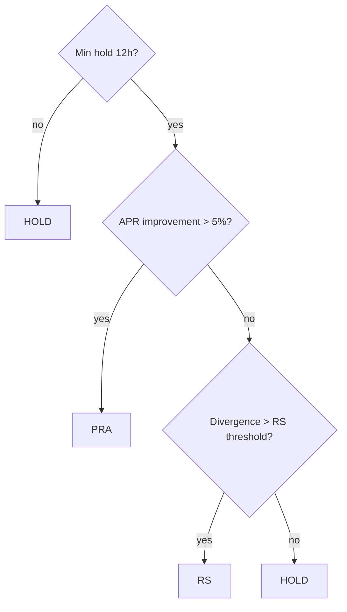

# Decision Engine

**Source**: `src/strategy/decision.ts`

The decision engine is a pure function that evaluates the current portfolio state against the optimal allocation and target ranges, producing one of three outcomes: **PRA**, **RS**, or **HOLD**.

## Decision Flow



**Priority**: PRA > RS. A PRA subsumes any range shifts because it burns all positions and redistributes from scratch.

## PRA Check (Pool Re-Allocation)

Compares the value-weighted current APR against the optimal allocation's weighted APR:

```typescript
const improvement = currentApr > 0
  ? (optimalApr - currentApr) / currentApr
  : aprGain > MIN_ABSOLUTE_APR_GAIN ? 1 : 0;

if (improvement > thresholds.pra) return { type: "PRA", ... };
```

Where `MIN_ABSOLUTE_APR_GAIN = 0.005` (0.5% absolute floor). Default `pra_threshold = 0.05` (5%). The current APR is value-weighted by `entryValueUsd` across all active positions.

Both PRA and RS are further gated by **gas-cost profitability checks**: the expected gain must exceed a gas-cost multiplier (`PRA_GAS_MULT = 1.5x`, `RS_GAS_MULT = 2.0x`) amortized over a configurable horizon. If the expected value doesn't clear the gas threshold, the decision falls back to HOLD.

## RS Check (Range Shift)

For each active position, computes divergence between its current tick range and the target range:

```typescript
const targetRange = computeRange(price, forces);

for (const pos of positions) {
  const currentRange = ticksToRange(pos.tickLower, pos.tickUpper, price);
  const div = rangeDivergence(currentRange, targetRange);
  if (div > thresholds.rs) {
    shifts.push({ pool, chain, oldRange, newRange });
  }
}
```

Default `rs_threshold = 0.25` (25% combined size + center divergence). The optimizer may adjust this between 0.10-0.35 based on historical fitness.

## Minimum Holding Period

All decisions are gated by a 12-hour minimum holding period:

```typescript
const MIN_HOLD_MS = 12 * 3600_000; // 12 hours

if (lastRebalTs !== undefined && now - lastRebalTs < MIN_HOLD_MS) {
  return { type: "HOLD", ... };
}
```

This prevents excessive churn from short-term signal fluctuations.

## Decision Output

```typescript
interface Decision {
  type: "PRA" | "RS" | "HOLD";
  ts: number;
  currentApr: number;
  optimalApr: number;
  improvement: number;
  targetAllocations: AllocationEntry[];
  rangeShifts?: {
    pool: `0x${string}`;
    chain: ChainId;
    oldRange: Range;
    newRange: Range;
  }[];
}
```

The `targetAllocations` are always present (from water-fill). The `rangeShifts` array is only populated for RS decisions.

## Execution Dispatch

After the decision, the scheduler dispatches to the executor:

| Decision | Executor Action |
|----------|----------------|
| **PRA** | Burn all positions, swap/bridge tokens, mint new positions per `targetAllocations` |
| **RS** | For each shifted position: burn, adjust range, re-mint in the same pool |
| **HOLD** | No on-chain action; log and persist state |

## Persistence

Each decision is ingested to OpenObserve:

```typescript
ingestToO2("pair_allocations", [{ pairId, decision: decision.type, ... }]);
```

## See Also

- [Water-Fill Allocation](allocation.md) -- how `optimalApr` and `targetAllocations` are computed
- [Range Computation](range.md) -- how `rangeDivergence` is calculated
- [Range Optimizer](optimizer.md) -- online tuning of `rsThreshold`
- [DEX Position Adapters](../execution/positions.md) -- mint/burn dispatching after PRA/RS
- [Token Rebalancing](../execution/swap.md) -- swap/bridge execution during PRA
- [Architecture](../architecture.md) -- where the decision step fits in the 5-step cycle
- [Glossary](../glossary.md) -- PRA, RS, HOLD definitions
